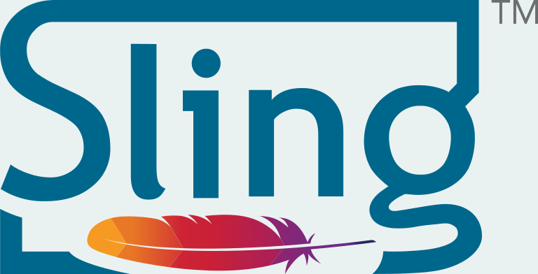
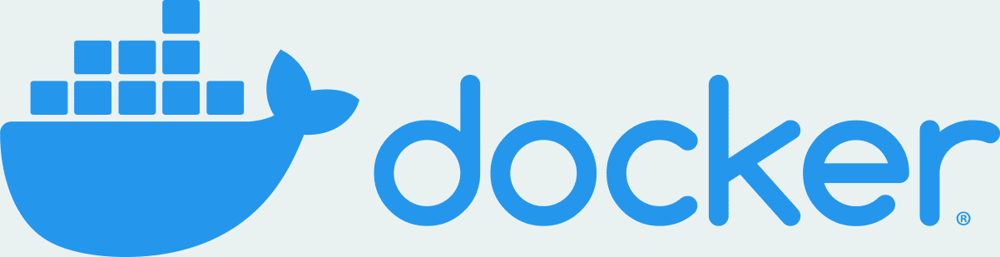
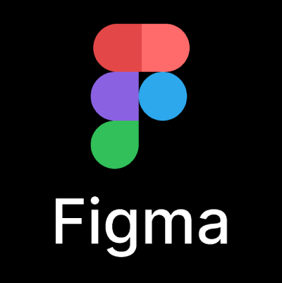

[](https://github.com/websight-io/starter/actions/workflows/ci.yml)

# WebSight Starter

WebSight Starter is a sample project built on top of the [Websight CMS Community Edition](https://www.websight.io/). It contains a demo page called _Luna_ built with [Howlite](https://github.com/websight-io/howlite) components.

## Playground

Set up a local on-demand environment with the released WebSight CMS CE Docker images by running:

```bash
curl https://www.websight.io/scripts/get.sh | sh
```

and then see the results on [localhost:8080/apps/websight/index.html/content::spaces](http://localhost:8080/apps/websight/index.html/content::spaces) (credentials are `wsadmin`/`wsadmin`).


For more details see our [Authoring Quick Start Guide](https://www.websight.io/docs/quick-start/).

## Websight Technologies

Find out what technologies Dynamic Solutions team have used to design, build and launch WebSight.

### CMS

Websight CMS makes use of the following technologies:
<table align="center">
  <tr>
    <td align="center" valign="middle">
      <a href="https://www.java.com" target="_blank">
        
      </a>
    </td>
    <td align="center" valign="middle">
      <a href="https://felix.apache.org" target="_blank">
        
      </a>
    </td>
    <td align="center" valign="middle">
      <a href="https://sling.apache.org" target="_blank">
        
      </a>
    </td>
        <td align="center" valign="middle">
      <a href="https://www.nginx.com" target="_blank">
        
      </a>
    </td>
  </tr>
  <tr>
    <td align="center" valign="middle">
      <a href="https://www.jackrabbit.apache.org" target="_blank">
        
      </a>
    </td>
    <td align="center" valign="middle">
      <a href="https://reactjs.org" target="_blank">
        
      </a>
    </td>
    <td align="center" valign="middle">
      <a href="https://www.typescriptlang.org" target="_blank">
        
      </a>
    </td>
    <td align="center" valign="middle">
      <a href="https://www.mongodb.com" target="_blank">
        
      </a>
    </td>          
  </tr>
</table>

### CMS Runtime

The following technologies are used for running WebSight:
<table align="center">
  <tr>
    <td align="center" valign="middle">
      <a href="https://aws.amazon.com" target="_blank">
        
      </a>
    </td>
    <td align="center" valign="middle">
      <a href="https://www.docker.com" target="_blank">
        
      </a>
    </td>                 
  </tr>
</table>

### CMS Supportive

The following technologies are used to support the process of delivery:
<table align="center">
  <tr>
    <td align="center" valign="middle">
      <a href="https://www.gnu.org/software/bash" target="_blank">
        
      </a>
    </td>
    <td align="center" valign="middle">
      <a href="https://maven.apache.org" target="_blank">
        
      </a>
    </td>
    <td align="center" valign="middle">
      <a href="https://www.cypress.io" target="_blank">
        
      </a>
    </td>
    <td align="center" valign="middle">
      <a href="https://www.percy.io" target="_blank">
        
      </a>
    </td>
  </tr>
  <tr>
    <td align="center" valign="middle">
      <a href="https://bitbucket.org/product/features/pipelines" target="_blank">
        
      </a>
    </td>
    <td align="center" valign="middle">
      <a href="https://www.atlassian.com/software/confluence" target="_blank">
        
      </a>
    </td>
    <td align="center" valign="middle">
      <a href="https://www.atlassian.com/software/jira" target="_blank">
        
      </a>
    </td>
        <td align="center" valign="middle">
      <a href="https://github.com/features/actions" target="_blank">
        
      </a>
    </td>
  </tr>
  <tr>
    <td align="center" valign="middle">
      <a href="https://yaml.org" target="_blank">
        
      </a>
    </td>         
  </tr>
</table>

### Design and Prototype

The following technologies are used in designing and prototyping:
<table align="center">
  <tr>
    <td align="center" valign="middle">
      <a href="https://www.figma.com" target="_blank">
        
      </a>
    </td>
    <td align="center" valign="middle">
      <a href="https://miro.com" target="_blank">
        
      </a>
    </td>            
  </tr>
</table>

## Development

### Prerequisites

- [AdoptOpenJDK 17](https://adoptium.net/) with `x64`/`aarch64` architecture (on mac use `brew install openjdk@17`).
- [Docker Desktop](https://www.docker.com/products/docker-desktop/)

### How to build

Run the command

```bash
./mvnw clean verify -P e2e
```

to build the sample websight, aggregate all required CMS dependencies, run end-to-end tests with Cypress, build Docker images (`ds/websight-nginx-starter:latest`, `ds/websight-cms-starter:latest`).

### How to run

Once Docker images are ready, all you need is to run Docker Compose from the `environment/local` folder:

```bash
docker compose up
```

CMS is available under: [localhost:8080/apps/websight/index.html/content::spaces](http://localhost:8080/apps/websight/index.html/content::spaces) (credentials are `wsadmin`/`wsadmin`).

Pages published from `Luna` space are available under [luna.127.0.0.1.nip.io](http://luna.127.0.0.1.nip.io/)

Pages published from `No Code Luna` space are available under [no-code.luna.127.0.0.1.nip.io](http://no-code.luna.127.0.0.1.nip.io/)

Pages published from `Bulma - Personal Template` space are available under [bulma.127.0.0.1.nip.io](http://bulma.127.0.0.1.nip.io/)

Please notice that we use a [nip.io](https://nip.io). It helps with simulating a real production environment that uses subdomains without the necessity to edit the `hosts` file on local machines.

## Project structure

- `application` - components related code and scripts
    - `backend` - contains application elements (components, templates, etc.) and Java code
- `content` - contains sample content created with use of application
- `distribution` - builds a distribution of the project - instance feature model and docker images for runtime components
- `environment` - contains scripts and files used but build environment
    - `local` - starts local environment
- `tests` - responsible for the automatic distribution validation
    - `content` - contains content used for end to end tests
    - `end-to-end` - end-to-end tests validating distribution

## Contributing
Please read our [Contributing Guide](./CONTRIBUTING.md) before submitting a Pull Request to the project.

## Community support

To support us, you may follow the project at:

* feel free to star this repository, open [issues](https://github.com/websight-io/starter/issues), and start [discussions](https://github.com/websight-io/starter/discussions)
* [linkedin.com/company/websight-io/](https://www.linkedin.com/company/websight-io/)
* [twitter.com/websight_io](https://twitter.com/websight_io)

## Documentation
See our dedicated repository for the [WebSight CMS documentation](https://github.com/websight-io/docs), or view our documentation live:

- [User guide](https://www.websight.io/docs/quick-start/)
- [Developer guide](https://www.websight.io/docs/developers/quick-start/)

## License

WebSight Starter and [Howlite components](https://github.com/websight-io/howlite) are `open-source` with `Apache License 2.0` license.

WebSight CMS Community Edition is free to use for everyone ([terms of use](https://www.websight.io/terms-of-use/)).
