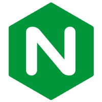
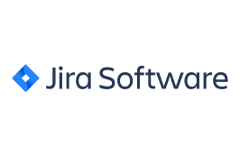

[](https://github.com/websight-io/starter/actions/workflows/ci-verify-build.yml)

# WebSight Blueprint

WebSight Blueprint is a sample project built on top of the [Websight CMS Community Edition](https://www.websight.io/).

It contains demo pages:

- Luna in three variants (no-code, low-code, custom-code) 
- Puresight
- Kyanite - personal template

Those pages are built with [Howlite](https://github.com/websight-io/howlite) and [Kyanite](https://github.com/websight-io/kyanite) component libraries.

## Playground

Set up a local on-demand environment with the released WebSight CMS CE Docker images by running:

```bash
curl https://docs.websight.io/scripts/get.sh | sh
```

and then see the results on [localhost:8080/apps/websight/index.html/content::spaces](http://localhost:8080/apps/websight/index.html/content::spaces) (credentials are `wsadmin`/`wsadmin`).


For more details see our [Authoring Quick Start Guide](https://docs.websight.io/cms/quick-start/).

## Websight Technologies

Find out what technologies the Dynamic Solutions team has used to design, build and launch WebSight.

### CMS

Websight CMS makes use of the following technologies:
<table align="center">
  <tr>
    <td align="center" valign="middle">
      <a href="https://www.java.com" target="_blank">
        
      </a>
    </td>
    <td align="center" valign="middle">
      <a href="https://felix.apache.org" target="_blank">
        
      </a>
    </td>
    <td align="center" valign="middle">
      <a href="https://sling.apache.org" target="_blank">
        
      </a>
    </td>
        <td align="center" valign="middle">
      <a href="https://www.nginx.com" target="_blank">
        
      </a>
    </td>
  </tr>
  <tr>
    <td align="center" valign="middle">
      <a href="https://www.jackrabbit.apache.org" target="_blank">
        
      </a>
    </td>
    <td align="center" valign="middle">
      <a href="https://reactjs.org" target="_blank">
        
      </a>
    </td>
    <td align="center" valign="middle">
      <a href="https://www.typescriptlang.org" target="_blank">
        
      </a>
    </td>
    <td align="center" valign="middle">
      <a href="https://www.mongodb.com" target="_blank">
        
      </a>
    </td>          
  </tr>
</table>

### CMS Runtime

The following technologies are used for running WebSight:
<table align="center">
  <tr>
    <td align="center" valign="middle">
      <a href="https://aws.amazon.com" target="_blank">
        
      </a>
    </td>
    <td align="center" valign="middle">
      <a href="https://www.docker.com" target="_blank">
        
      </a>
    </td>                 
  </tr>
</table>

### CMS Supportive

The following technologies are used to support the process of delivery:
<table align="center">
  <tr>
    <td align="center" valign="middle">
      <a href="https://www.gnu.org/software/bash" target="_blank">
        
      </a>
    </td>
    <td align="center" valign="middle">
      <a href="https://maven.apache.org" target="_blank">
        
      </a>
    </td>
    <td align="center" valign="middle">
      <a href="https://www.cypress.io" target="_blank">
        
      </a>
    </td>
    <td align="center" valign="middle">
      <a href="https://www.percy.io" target="_blank">
        
      </a>
    </td>
  </tr>
  <tr>
    <td align="center" valign="middle">
      <a href="https://bitbucket.org/product/features/pipelines" target="_blank">
        
      </a>
    </td>
    <td align="center" valign="middle">
      <a href="https://www.atlassian.com/software/confluence" target="_blank">
        
      </a>
    </td>
    <td align="center" valign="middle">
      <a href="https://www.atlassian.com/software/jira" target="_blank">
        
      </a>
    </td>
        <td align="center" valign="middle">
      <a href="https://github.com/features/actions" target="_blank">
        
      </a>
    </td>
  </tr>
  <tr>
    <td align="center" valign="middle">
      <a href="https://yaml.org" target="_blank">
        
      </a>
    </td>         
  </tr>
</table>

### Design and Prototype

The following technologies are used in designing and prototyping:
<table align="center">
  <tr>
    <td align="center" valign="middle">
      <a href="https://www.figma.com" target="_blank">
        
      </a>
    </td>
    <td align="center" valign="middle">
      <a href="https://miro.com" target="_blank">
        
      </a>
    </td>            
  </tr>
</table>

## Development

You need to have Java 17 installed to build the project.

To build the project, run:

```bash
./mvnw clean package
```

To start a local instance, run:

```bash
distribution/target/dependency/org.apache.sling.feature.launcher/bin/launcher \
  -f distribution/target/slingfeature-tmp/feature-websight-cms-starter-tar.json
```

Then open http://localhost:8080/ in a Web browser and log in using the credentials `wsadmin`/`wsadmin`.

For more details please refer to our [Developers quick start guide](https://docs.websight.io/cms/developers/quick-start/).

### Run modes

Running the `starter` WebSight CMS project requires selecting [OAK Node Storage](https://jackrabbit.apache.org/oak/docs/nodestore/overview.html) mode. To choose the mode, run the distribution with one of the following configuration files:
- `feature-websight-cms-starter-tar.json` - starts the project with the `TAR` Segment NodeStore mode (uses the local file system, by default `./launcher` directory)
- `feature-websight-cms-starter-mongo.json` - starts the project with the `MongoDB` Document NodeStore mode (requires MongoDB instance)
    
To run the `stater` project with MongoDB run:
```bash
docker run -d -p 27017:27017 --env MONGO_INITDB_ROOT_USERNAME=mongoadmin \
  --env MONGO_INITDB_ROOT_PASSWORD=mongoadmin mongo
  
MONGODB_HOST=localhost && MONGODB_PORT=27017 && distribution/target/dependency/org.apache.sling.feature.launcher/bin/launcher \
  -f distribution/target/slingfeature-tmp/feature-websight-cms-starter-mongo.json
```

## Project structure

- `applications` - components related code and scripts
    - `luna-custom-code` - contains code related to `custom-code` version of the Luna project
      - `backend` - contains application elements (components, templates, etc.) and Java code
      - `frontend` - contains frontend elements (scss, ts, fonts etc.)
    - `luna-low-code` - contains code related to `low-code` version of the Luna project
      - `backend` - contains application elements (components, templates, etc.) and Java code
      - `frontend` - contains frontend elements (scss, ts, fonts etc.)
    - `puresight` - contains code related to Puresight project
      - `backend` - contains application elements (components, templates, etc.) and Java code
      - `frontend` - contains frontend elements (scss, ts, fonts etc.)
      - `content` - contains initial content related to the project
- `content` - contains sample content created with use of application
- `distribution` - builds a distribution (Sling OSGi Feature) of the project
- `tests` - responsible for the automatic distribution validation
    - `content` - contains content used for end-to-end tests
    - `end-to-end` - end-to-end tests validating distribution

## Executing end-to-end tests

Check the tests [README](./tests/README.md) for more details.

## Docker
You can run a containerized version of the project by building the Docker image with the following command:
```bash
docker build -t ds/websight-cms-starter .
```
And running it with:
```bash
docker run -p 8080:8080 --name websight-cms --rm \
  --mount source=segment-store-repository,target=/websight/launcher/repository ds/websight-cms-starter
```

By default, the `tar` mode is used.

You can find an example WebSight CMS Starter with MongoDB setup in the [CMS Helm Chart](https://github.com/websight-io/charts).

## Contributing

Please read our [Contributing Guide](./CONTRIBUTING.md) before submitting a Pull Request to the project.

## Community support

To support us, you may follow the project at:

* feel free to star this repository, open [issues](https://github.com/websight-io/starter/issues), and start [discussions](https://github.com/websight-io/starter/discussions)
* [linkedin.com/company/websight-io/](https://www.linkedin.com/company/websight-io/)
* [twitter.com/websight_io](https://twitter.com/websight_io)

## Documentation

See our dedicated repository for the [WebSight CMS documentation](https://github.com/websight-io/docs), or view our documentation live:

- [User guide](https://docs.websight.io/cms/quick-start/)
- [Developer guide](https://docs.websight.io/cms/developers/quick-start/)

## License

WebSight Blueprint, [Kyanite components](https://github.com/websight-io/kyanite) and [Howlite components](https://github.com/websight-io/howlite) are `open-source` with `Apache License 2.0` license.

WebSight CMS Community Edition is free to use for everyone ([terms of use](https://docs.websight.io/terms-of-use/)).
